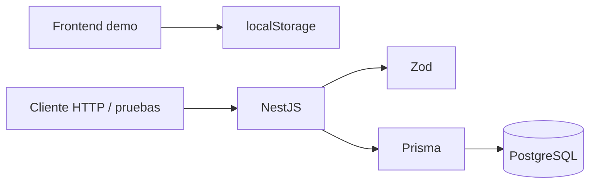
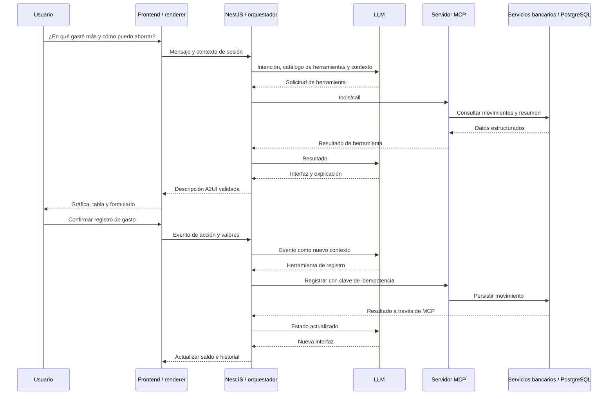

# Arquitectura

## Estructura que existe

```text
client/                   React + Vinext; UI por dominios
server/
  src/
    modules/
      cuentas/            Resumen y saldo de la cuenta demo
      movimientos/        Registro, consultas y reglas del historial
      salud/              Liveness y readiness
    config/               Variables validadas con Zod
    database/             Ciclo de vida de Prisma
    shared/               Pipe Zod y conversión segura de centavos
    generated/prisma/     Generado; no se versiona
  prisma/                 Esquema, migración y seed
mcp/                      Guía; servidor por implementar
docs/                     Arquitectura, contratos y backlog
compose.yaml              Solo PostgreSQL con volumen persistente
```

Los nombres de los módulos expresan el negocio. `controllers`, `services` y `schemas` viven dentro del dominio; no hay carpetas globales con todos los controladores o servicios.

Frontend, NestJS, migraciones y seed se ejecutan como procesos locales. Docker se utiliza únicamente para PostgreSQL.

## Hoy



## Objetivo del reto — pendiente



## Decisiones

| Decisión | Motivo / límite |
| --- | --- |
| Monolito modular NestJS | Menos operación para el hackathon; reglas reutilizables por HTTP y MCP |
| Prisma + PostgreSQL | Migraciones versionadas, integridad y persistencia de acciones |
| Zod en límites HTTP y configuración | Tipos inferidos y rechazo de campos desconocidos |
| Centavos `BigInt` en DB | Sumas exactas; conversión comprobada al responder JSON |
| Saldo calculado | Evita mantener un segundo saldo mutable que se desincronice |
| Cuenta demo única | Permite demostrar el flujo sin implementar identidad todavía |
| Herramientas y UI por catálogo | El agente seleccionará capacidades explícitas del proyecto |
| MCP como proceso separado | Límite de protocolo claro; inicialmente puede llamar la API interna |

No hacen falta Redis, colas, microservicios, CQRS ni Kubernetes para este alcance. La próxima inversión de ingeniería debe cerrar el ciclo de interacción generativa.
