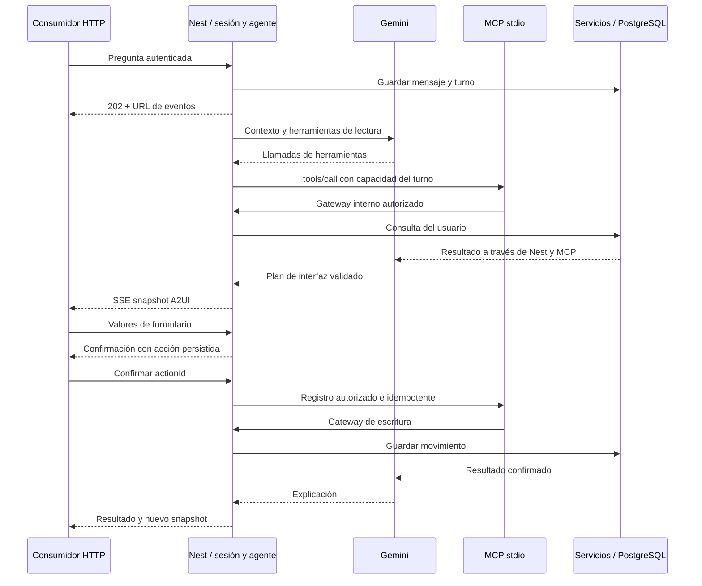

# Arquitectura

```text
client/                     React; pantallas conectadas a Nest y renderer A2UI
server/
  src/
    modules/
      autenticacion/        Login, sesiones, guard y aprovisionamiento privado
      perfil/               Perfil, tarjetas y catálogo
      cuentas/              Cuenta y saldo propio
      movimientos/          Registro e historial
      analisis/             Agregados por periodo
      metas/                Objetivos persistentes
      simulaciones/         Proyecciones educativas
      conocimiento/         RAG documental, embeddings y fuentes con vigencia
      asistente/            Conversaciones, turnos, acciones y SSE
      salud/                Liveness/readiness
    integrations/llm/       Adaptador Gemini
    integrations/mcp/       Cliente, capacidades y gateway interno
    ui-protocol/            Catálogo y mensajes A2UI
    config/                 Entorno validado con Zod
    database/               Prisma
    shared/                 Validación HTTP, idempotencia y dinero
  prisma/                   Esquema, migraciones y seed
mcp/server.ts                  Fuente TypeScript del servidor SDK MCP por stdio
docs/                       Contratos y pendientes
compose.yaml                Solo PostgreSQL
```

Monolito modular por negocio. Los módulos pequeños reúnen servicio/controlador en su archivo de módulo; cuentas y movimientos conservan sus subcarpetas por responsabilidad. No hay microservicios de dominio ni carpetas globales de todos los controllers.

## Flujo implementado en backend



La prueba usó un modelo controlado, con MCP y DB reales. El consumidor visual A2UI está conectado y fue probado en navegador. Se configuró Gemini Flash-Lite y se validó el ciclo desde navegador con una llamada real.

## Decisiones

- Sesión opaca en PostgreSQL: revocación inmediata y guard por propietario sin access/refresh JWT.
- Capacidades MCP opacas breves por proceso: identidad y permisos fuera del control del modelo.
- BigInt y saldo calculado: sumas exactas y una sola fuente de verdad.
- Catálogo visual cerrado: componentes y datos permitidos, sin ejecutar código generado.
- Turnos persistidos y snapshots: recuperar estado tras desconexión; al reiniciar se marcan interrumpidos los activos.
- Una instancia Nest local: limita complejidad. Rate limits y capacidades en memoria; falta coordinación distribuida si se escala.

PostgreSQL es el único proceso en Docker. El frontend consume estas rutas y renderiza el protocolo; localStorage ya no es la fuente de su historial.

## Adaptación y contexto

El plan admite `movementDraft`, `comparison` y `knowledgeQuotes`. Los borradores se validan y requieren revisión y confirmación; la tarjeta debe pertenecer al perfil. `compare_spending_periods` conserva dos consultas y calcula sus diferencias. La caché identifica llamadas por nombre y argumentos. Los seis turnos completados más recientes aportan al siguiente mensaje un contexto compacto de acciones, simulaciones, periodos y borradores, exclusivamente de la conversación propia. Los cálculos y las escrituras siguen siendo deterministas.

El frontend comprueba los componentes anunciados por el catálogo, valida snapshots y muestra errores de compatibilidad legibles. Ver [plan ejecutado](plan-mejoras-reto.md) y [evaluación](evaluacion-adaptativa.md).
