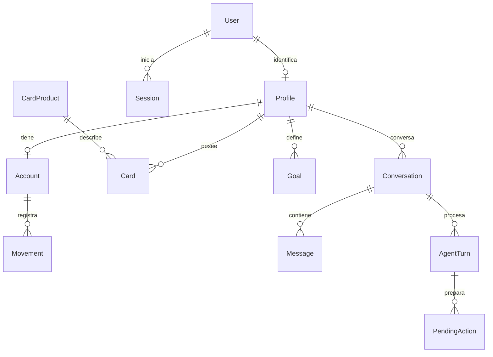

# Base de datos y Prisma

## Modelo actual



User guarda email normalizado, passwordHash y active. Session guarda hash del token, CSRF y vencimientos. Las entidades de negocio pertenecen al perfil, directamente o a través de la cuenta/conversación. Card guarda solo last4, estado y producto; CardProduct contiene nombre, red e imageKey. El email tiene una única fuente de verdad: User.

La clave `(accountId, idempotencyKey)` hace único cada movimiento. Goal y Conversation conservan input original y clave por perfil. AgentTurn tiene clave por conversación y un índice parcial que impide dos turnos queued/running simultáneos en ella. PendingAction guarda payload aprobado, sesión, estado, caducidad y resultado recuperable.

## Dinero

Centavos BigInt, con límites positivos en esquema/DB. `saldo = saldoInicial + SUM(ingresos) - SUM(gastos)`. Convertir a JSON solo si el número es seguro. La simulación usa BigInt y redondeo half-up mensual, sin floats de dinero. Metas y simulaciones no alteran el saldo.

## Migración y seed

La segunda migración crea identidad y entidades del asistente, asocia explícitamente la cuenta original al perfil inicial y conserva su historial. El usuario original queda deshabilitado hasta aprovisionar credenciales privadas mediante seed. No se usa el primer registro público para reclamar esa cuenta.

`db:seed` siembra catálogo Clásica/Oro/Infinite, asigna Clásica y Oro al propietario inicial, conserva preferencia y movimientos existentes. Opcionalmente habilita al usuario mediante BOOTSTRAP_EMAIL/BOOTSTRAP_PASSWORD; no reemplaza credenciales ya activas. Repetir el seed no duplica filas ni borra registros manuales.

El registro de cada usuario crea una cuenta nueva y nueve movimientos de ejemplo con fechas relativas al día de alta, UUID propios y claves estables por cuenta. Su saldo inicial resultante es $284,650.00 MXN. `source: demo` identifica el origen de ejemplo; `manual` identifica los movimientos registrados. No se comparten filas entre usuarios ni se insertan datos al hacer login.

## Comandos

```sh
cd server
npm run prisma:generate
npm run db:deploy
npm run db:seed
```

Para cambiar modelo: `npm run db:migrate -- --name descripcion_del_cambio`, luego regenerar Prisma. Versionar schema y migraciones; `src/generated/prisma` queda ignorado. No usar db push ni borrar el volumen para aplicar cambios de código.
