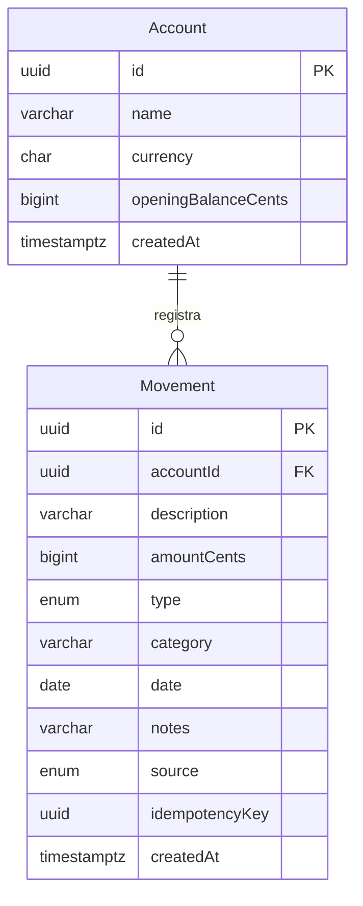

# Base de datos y Prisma

## Modelo actual



La clave `(accountId, idempotencyKey)` es única. Los índices comienzan por cuenta y cubren orden por fecha y filtros por tipo/categoría. La relación impide borrar una cuenta con movimientos. La migración también agrega un `CHECK` para el rango positivo de centavos y otro para moneda MXN.

`saldo = saldoInicial + SUM(ingresos) - SUM(gastos)`. Nunca se calcula dinero mediante floats dentro de la DB. Los `BigInt` se convierten a números JSON solo después de comprobar `Number.isSafeInteger`.

## Seed reproducible

Una cuenta ficticia y nueve movimientos alineados con el dataset inicial del frontend. El saldo inicial resultante es $284,650.00 MXN. Las fechas son fijas de septiembre de 2026 para que el guion sea reproducible.

El seed usa una transacción y `upsert` con claves estables: ejecutarlo otra vez no duplica movimientos ni borra registros manuales. No carga usuarios, contraseñas, PAN completos ni datos bancarios reales.

## Flujo de cambios

Desde `server`, con `.env` configurado:

```sh
npm run prisma:generate
npm run db:deploy
npm run db:seed
```

Para modificar el modelo durante desarrollo:

```sh
npm run db:migrate -- --name descripcion_del_cambio
npm run prisma:generate
```

Versionar `schema.prisma` y `prisma/migrations`. No versionar `src/generated/prisma`. `migrate deploy` aplica migraciones versionadas; no usar `db push` como sustituto del historial de migración del equipo.

## Siguientes entidades

Solo crear cuando su flujo vaya a implementarse: `Goal` para metas persistentes; `Conversation` y `Message` para contexto; `AgentAction` para resultado y clave de reintento. `User` y sesiones requieren una decisión de autenticación. Las tarjetas actuales son un catálogo visual; no necesitan números sensibles en la base.
