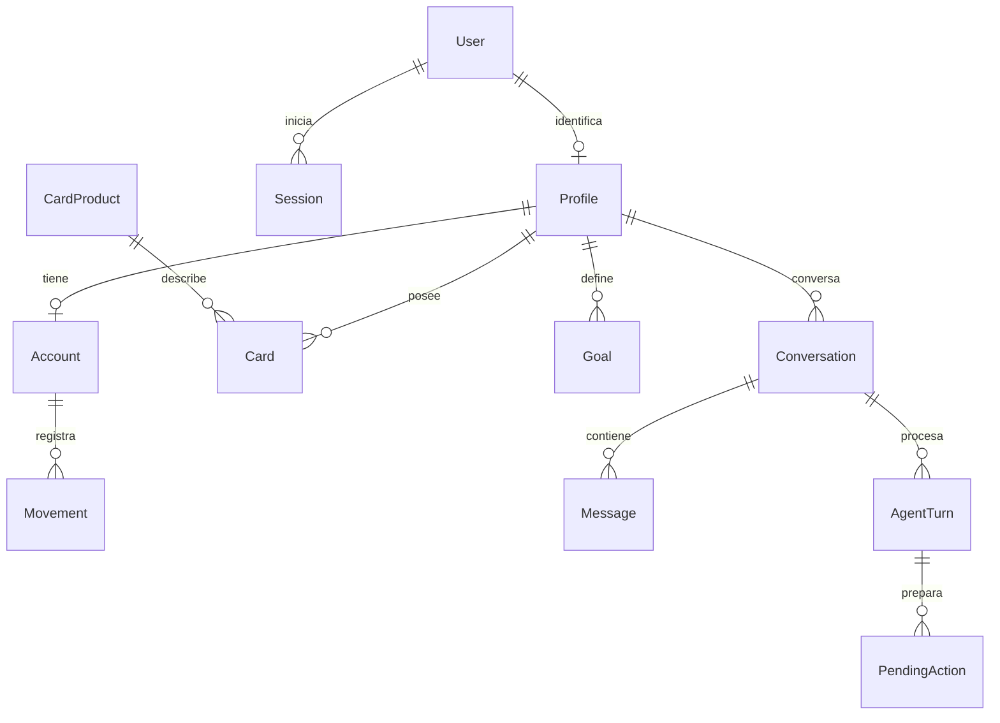

# Base de datos y Prisma

## Modelo actual



User guarda email normalizado, passwordHash y active. Session guarda hash del token, CSRF y vencimientos. Las entidades de negocio pertenecen al perfil, directamente o a través de la cuenta/conversación. Card guarda solo last4, estado y producto; CardProduct contiene nombre, red e imageKey. El email tiene una única fuente de verdad: User.

La clave `(accountId, idempotencyKey)` hace único cada movimiento. Goal y Conversation conservan input original y clave por perfil. AgentTurn tiene clave por conversación y un índice parcial que impide dos turnos queued/running simultáneos en ella. PendingAction guarda payload aprobado, sesión, estado, caducidad y resultado recuperable.

## Dinero

Centavos BigInt, con límites positivos en esquema/DB. `saldo = saldoInicial + SUM(ingresos) - SUM(gastos)`. Convertir a JSON solo si el número es seguro. La simulación usa BigInt y redondeo half-up mensual, sin floats de dinero. Metas y simulaciones no alteran el saldo.

## Migración y seed

La segunda migración crea identidad y entidades del asistente, asocia explícitamente la cuenta original al perfil inicial y conserva su historial. El usuario original queda deshabilitado hasta aprovisionar credenciales privadas mediante seed. No se usa el primer registro público para reclamar esa cuenta.

`db:seed` siembra solo el catálogo Clásica/Oro/Infinite y aprovisiona los accesos privados. No asigna tarjetas automáticamente ni crea actividad financiera. Opcionalmente habilita al usuario mediante BOOTSTRAP_EMAIL/BOOTSTRAP_PASSWORD; no reemplaza credenciales ya activas. Repetir el seed no duplica filas ni borra registros manuales.

El aprovisionamiento crea una cuenta con apertura cero e historial vacío. Los movimientos nuevos tienen `source: manual`. El enum demo se conserva únicamente por compatibilidad con migraciones anteriores; ninguna ruta ni seed lo genera.

## Comandos

```sh
cd server
npm run prisma:generate
npm run db:deploy
npm run db:seed
```

Para cambiar modelo: `npm run db:migrate -- --name descripcion_del_cambio`, luego regenerar Prisma. Versionar schema y migraciones; `src/generated/prisma` queda ignorado. No usar db push ni borrar el volumen para aplicar cambios de código.

## Asociación con tarjeta y dos accesos

La migración `20260912020000_movement_cards` añade `Movement.cardId` nullable, relación a Card e índice. Asocia los ejemplos conocidos del historial inicial sin cambiar importes ni fechas; los manuales anteriores quedan en cuenta personal. Las altas nuevas validan la titularidad de la tarjeta y las consultas incluyen su producto y last4.

El seed puede crear la segunda cuenta con `SECOND_TEST_EMAIL`/`SECOND_TEST_PASSWORD` si todavía hay menos de dos usuarios. Conserva usuarios, credenciales y movimientos existentes. La interfaz no expone registro público.

## Retiro de datos precargados

`20260912030000_remove_sample_history` elimina únicamente movimientos `source = demo` y pone en cero la apertura fija del aprovisionamiento antiguo en las cuentas identificadas. No borra movimientos manuales, credenciales, tarjetas, metas ni conversaciones. En la base local, Manuel y Alex tenían nueve ejemplos y ningún movimiento manual; ambos quedaron en cero.

El catálogo de productos, las categorías, MXN y la configuración regional son metadatos del producto. No representan dinero, historial ni titularidad de tarjetas del usuario. Los snapshots antiguos de conversaciones son históricos; una consulta nueva obtiene los datos actuales mediante MCP.

## Conocimiento documental

`KnowledgeDocument` guarda producto, archivo, hashes, modelo y vigencia. `KnowledgeChunk` guarda página PDF, ordinal, texto, vigencia efectiva y `vector(768)`. La migración `20260912050000_financial_knowledge` habilita pgvector y crea ambas tablas sin cambiar entidades financieras. Para este corpus pequeño se usa búsqueda exacta por distancia coseno, con filtros previos. Ver [RAG](rag.md).
