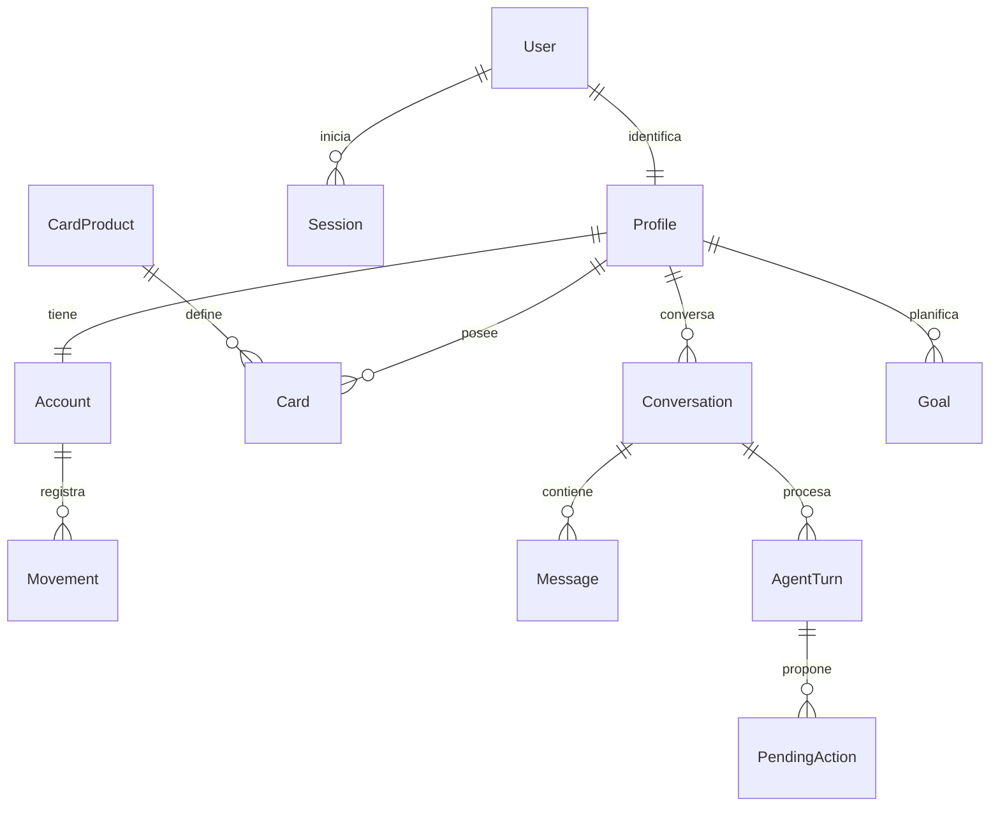

# Plan del backend

Estado actualizado: **backend implementado**. Este documento conserva el plan original como referencia; las secciones futuras describen el punto de partida y no el estado actual. Los contratos vigentes están en [backend.md](backend.md) y [endpoints.md](endpoints.md).

Se completaron autenticación, perfiles/tarjetas, historial aislado, análisis, metas, simulación, conversaciones, MCP y generación A2UI del lado servidor. Gemini Flash-Lite ya se validó en una prueba real desde navegador. Los datos precargados se retiraron; los perfiles nuevos empiezan en cero. El frontend y su renderer están conectados y probados con MCP real y modelo controlado. El registro público se retiró: solo dos cuentas de prueba aprovisionadas. El resto de este documento conserva el plan histórico; consultar endpoints.md y frontend.md para el contrato vigente. Tarjetas se agrupan en el módulo perfil; MCP usa capacidades opacas en memoria, no JWT firmado; SSE envía snapshots y no deltas de texto. No se recreó server/test.

## 1. Alcance y decisiones

| Decisión | Alcance |
| --- | --- |
| Backend | NestJS local, por dominios; Prisma + Zod |
| Infraestructura | Únicamente PostgreSQL en Docker |
| Identidad | Registro y login reales con email/contraseña, hash Argon2id y sesiones en PostgreSQL; un usuario inicial |
| Cuenta | Una cuenta personal MXN por usuario, con historial inicial de ejemplo y movimientos propios persistentes |
| Tarjetas asignadas | Dos instancias del cliente; Clásica y Oro como elección propuesta, intercambiable por Infinite |
| Catálogo | Clásica, Oro e Infinite; el catálogo no implica que el cliente tenga las tres |
| Interfaz | Pantallas actuales; conectar primero Inicio, Movimientos, Tarjetas y Perfil |
| IA | Un agente en NestJS con proveedor configurable, herramientas MCP y salida A2UI |
| Educación | Explicaciones contextuales dentro del asistente |
| Inversiones | Simulación educativa posterior al flujo principal, con supuestos explícitos |

No se implementarán en el MVP contratación de productos, transferencias reales, procesamiento de pagos, recuperación de contraseñas ni operaciones de inversión. Las tarjetas iniciales muestran asignación y estado de demostración; no modelan una línea de crédito, deuda, intereses o corte.

Clásica y Oro son una suposición para concretar el seed, no una selección confirmada por el usuario. Se conserva un perfil inicial con dos tarjetas. Si se registran más usuarios, cada uno recibe su propio perfil, cuenta, dos tarjetas e historial inicial aislado.

## 2. Punto de partida verificado

Existen `Account` y `Movement` en Prisma; endpoints de salud, cuenta, categorías y registro/consulta de movimientos. Ya funcionan centavos enteros, filtros, paginación, saldo calculado y reintentos idempotentes. Mantener sus rutas y contratos al ampliar el backend.

El frontend todavía usa `localStorage` para movimientos; las tarjetas son un catálogo visual; el perfil es estático y las metas viven en memoria de la sesión. No hay modelos de perfil/tarjeta, servidor MCP ni llamadas LLM/A2UI implementados.

## 3. Organización propuesta

```text
server/src/
  modules/
    autenticacion/         Registro, login, sesiones, CSRF y guard
    perfil/                Perfil del usuario autenticado y preferencias
    cuentas/               Cuenta y saldo (existe)
    tarjetas/              Productos y tarjetas asignadas
    movimientos/           Registro e historial (existe)
    analisis/              Agregados de gasto y flujo de dinero
    asistente/             Conversaciones, turnos, contexto y acciones
    metas/                 Objetivos persistentes (fase posterior)
    simulaciones/          Cálculos educativos (fase posterior)
    salud/                 Liveness/readiness (existe)
  integrations/
    llm/                   Adaptador del proveedor, streaming y herramientas
    mcp/                   Cliente MCP y conexión con el proceso de herramientas
  ui-protocol/
    a2ui/                  Validación del protocolo y catálogo permitido
  config/                  Variables Zod (existe)
  database/                Prisma (existe)
  shared/                  Pipes, dinero y fechas (existe)

mcp/src/
  tools/                   Adaptadores de herramientas a la API bancaria
  transport/               stdio para la demo local
  main.ts                  Arranque del servidor MCP
```

Dentro de cada dominio: `controllers`, `services`, `schemas` y `types` si son necesarios. Prisma sigue siendo el acceso a datos; no agregar repositorios genéricos ni clases base sin una necesidad concreta. No se requiere un framework multiagente, Redis ni una cola externa para este MVP.

## 4. Datos y relaciones



El aprovisionamiento inicial crea un usuario con un perfil, una cuenta y dos tarjetas. Cada registro posterior crea recursos propios y un historial de ejemplo independiente. La restricción de una cuenta por perfil puede modelarse con `Account.profileId @unique`. Las conversaciones múltiples representan distintas consultas del mismo perfil.

| Entidad | Campos / reglas previstos |
| --- | --- |
| `User` | UUID, email normalizado único, passwordHash Argon2id, estado y timestamps |
| `Session` | UUID, userId, tokenHash, csrfToken, expiresAt, lastSeenAt y revocación |
| `Profile` | UUID, userId único, nombre visible, locale, timezone, preferredCardId opcional, createdAt/updatedAt; email proviene de User |
| `Account` | Modelo actual + profileId; conservar UUID, moneda y saldo inicial existentes |
| `CardProduct` | key `clasica/ oro/ infinite` única, nombre, network, imageKey; sin imagen binaria |
| `Card` | UUID, profileId, productKey, last4, estado demo `active/inactive`, createdAt; sin PAN/CVV/PIN |
| `Movement` | Modelo actual; el servidor mantiene cuenta, source y clave de idempotencia |
| `Conversation` | UUID, profileId, título, createdAt/updatedAt |
| `Message` | UUID, conversationId, role `user/assistant`, contenido y createdAt; resultados de herramientas separados del texto visible |
| `AgentTurn` | UUID, conversationId, inputMessageId opcional, requestKey, input normalizado, status, último estado A2UI validado, revision, errorCode, trace resumido y timestamps |
| `PendingAction` | UUID, conversationId, turnId, profileId, surfaceId, revision, acción permitida, payload normalizado, status, expiresAt, executionKey y resultado |
| `Goal` — posterior | UUID, profileId, nombre, targetCents, deadline opcional, estado y timestamps; inicialmente sin aportaciones ni retiros |

`preferredCardId` debe pertenecer al mismo perfil; el servicio valida esa relación. El trace de un turno guarda nombres de herramientas, estado y duración, no razonamiento interno del modelo ni secretos.

### Tarjeta e imagen

El aprovisionamiento inicial o registro asigna dos filas `Card` al perfil en la misma transacción que la cuenta y el historial inicial. Cada una apunta a `CardProduct`. La respuesta combina instancia y producto, pero conserva ambos IDs:

```text
Alex Morgan
  card UUID-A · •••• 4281 → CardProduct clasica → imageKey clasica
  card UUID-B · •••• 9032 → CardProduct oro     → imageKey oro
```

React resuelve `imageKey` mediante el catálogo existente:

| imageKey | Asset existente del frontend |
| --- | --- |
| `clasica` | `/images/cards/banorte-clasica.png` |
| `oro` | `/images/cards/banorte-oro.png` |
| `infinite` | `/images/cards/banorte-infinite.png` |

Las rutas son relativas al sitio frontend, no al servidor Nest. Mantener imagen y estilo en React permite reutilizarlos entre clientes. La API no acepta URLs de imagen del modelo.

Los movimientos del MVP pertenecen a la cuenta personal. No atribuir gastos a una tarjeta ni mostrar saldos de crédito sin implementar ese modelo: las dos tarjetas son por ahora información del perfil, separada del libro de movimientos.

### Migración, registro e historial inicial

1. Crear User, Session, Profile, CardProduct y Card; agregar profileId temporalmente nullable a Account.
2. Aprovisionar explícitamente el usuario inicial con credenciales privadas locales y asociarle la cuenta existente y su historial. Nunca asignar esos datos al primero que se registre.
3. Volver profileId requerido/único después del backfill y agregar el catálogo de productos y dos tarjetas mediante claves estables.
4. Para cada registro nuevo, crear User, Profile, Account, dos Card y una copia independiente del dataset inicial en una transacción. Usar UUID propios y claves de seed estables por cuenta.
5. Los movimientos iniciales llevan procedencia de ejemplo; los que registra el usuario conservan procedencia manual. No cargar historial al hacer login ni duplicarlo al repetir seed.
6. Elegir Clásica como preferencia inicial propuesta sin sobrescribir preferencias posteriores. Conservar movimientos y saldo existentes; no resetear la DB ni el volumen.

La cuenta de una solicitud se obtiene de la sesión: `userId → profileId → accountId`. Retirar `DEMO_ACCOUNT_ID` del acceso normal después de implementar guards y autorización. El body y el LLM nunca deciden el propietario. Ver [autenticacion.md](autenticacion.md) para el contrato y controles.

## 5. Reglas compartidas

- Todos los recursos del dominio se filtran por el perfil/cuenta del usuario autenticado. Un ID fuera de ese ámbito devuelve 404; sin sesión válida, 401.
- Dinero como centavos enteros positivos para importes y valores con signo solo en netos; DB `BigInt`, conversión segura a JSON. La cuenta puede tener saldo demo negativo; no se simula autorización bancaria.
- Fechas de movimiento como `YYYY-MM-DD`; timestamps de respuestas como milisegundos Unix, conservando el contrato existente; zona de negocio `America/Monterrey`.
- Validación Zod estricta en cuerpos, query y acciones del agente. Orden de fechas válido, límites de listas, texto y montos.
- Mantener los endpoints actuales de lectura/registro. No introducir edición/borrado de movimientos en el MVP.
- `Idempotency-Key` para crear movimientos, conversaciones, turnos y metas. Misma clave y mismo input devuelve el recurso existente; input diferente devuelve 409. Las claves se acotan al propietario y operación.
- Guardar una preferencia con PATCH es una asignación idempotente; no requiere otra clave.
- CORS con orígenes exactos y credenciales, cookie HttpOnly y validación CSRF en escrituras; agregar PATCH y X-CSRF-Token cuando se integre autenticación. Ver [autenticacion.md](autenticacion.md).

## 6. Consultas para gráficas

Crear `analisis` antes de conectar el LLM a gráficos. Los números proceden de consultas del backend y no de estimaciones del modelo.

- Resumen por periodo: ingresos, gastos, neto y cantidad de movimientos.
- Gastos por categoría: total en centavos y proporción calculada con la misma selección.
- Serie temporal: buckets por día/mes según rango, con ceros en periodos vacíos y límite de rango de un año para el MVP.
- Por defecto usar el mes actual en la zona del perfil y devolver el periodo resuelto en la respuesta.
- Saldo actual y neto del periodo son conceptos distintos; no restar gastos históricos dos veces al saldo.

Un único endpoint `/insights/spending` devolverá categorías, serie y totales. No crear un endpoint por cada componente visual.

## 7. LLM, MCP y A2UI

### Responsabilidades

| Parte | Decide / ejecuta |
| --- | --- |
| LLM | Interpreta intención, pide datos, elige composición visual y propone siguientes acciones |
| Orquestador Nest | Contexto, límites, validación, permisos de herramientas y envío de mensajes |
| Cliente MCP en Nest | Descubre herramientas y transporta llamadas/resultados |
| Servidor MCP local | Expone herramientas que usan los endpoints bancarios |
| Servicios del backend | Reglas de dinero, consultas y persistencia |
| Renderer React | Componentes propios, inputs, accesibilidad y eventos del usuario |

Candidato inicial recomendado: Gemini Flash mediante `@google/genai`, con modelo configurable. La recomendación previa fue `gemini-3.8-flash`; confirmar disponibilidad y medir llamadas a herramientas y salida estructurada al integrar. No se necesita entrenar un modelo propio. Mantener un adaptador pequeño para cambiar de proveedor.

A2UI propuesto: v0.9.1 con renderer React y `web_core`; fijar versiones compatibles al instalar. Los componentes del catálogo Banorte se registran sobre ese renderer. No confundir la versión de protocolo con la versión npm del paquete.

### Herramientas iniciales

| Herramienta MCP | Endpoint usado |
| --- | --- |
| `get_profile` | GET `/me` |
| `list_my_cards` | GET `/me/cards` |
| `get_account_summary` | GET `/account` |
| `list_movements` | GET `/movements` |
| `get_movement` | GET `/movements/:id` |
| `list_movement_categories` | GET `/movements/categories` |
| `get_spending_insights` | GET `/insights/spending` |
| `register_movement` | POST `/movements`, con payload aprobado y executionKey |

El proceso MCP usa `stdio` local. Cada llamada conserva contexto autorizado del usuario; no usar una cuenta global ni confiar en IDs del modelo. El esquema de credenciales internas de alcance limitado se describe en [autenticacion.md](autenticacion.md). Estas son herramientas MCP reales, no endpoints REST renombrados; implementar descubrimiento `tools/list` y ejecución `tools/call` usando el SDK. Los endpoints REST son su acceso al dominio. No hace falta exponer `/mcp` HTTP en Nest para `stdio`.

### Turnos y streaming

1. Crear conversación y enviar mensaje por POST.
2. Persistir mensaje y turno; responder 202 con `turnId` y URL del stream antes de ejecutar trabajo largo.
3. Un proceso local de Nest ejecuta el turno con un máximo inicial de 6 llamadas a herramientas y timeout de 30 segundos, ajustables tras medir.
4. Transmitir por SSE estados, mensajes de texto y mensajes A2UI completos validados. Nunca enviar fragmentos JSON incompletos al renderer.
5. Persistir estado final o error y el último snapshot A2UI validado antes de marcar el turno terminado.
6. En reconexión, leer el snapshot del turno y reabrir el stream. La propuesta no promete replay ilimitado de todos los eventos.

El SSE es un transporte con eventos de aplicación que envuelven mensajes A2UI oficiales; el frontend extrae el mensaje antes de entregarlo a `web_core`. No llamar A2UI a una estructura JSON arbitraria.

Un turno activo por conversación; otro envío distinto devuelve 409 `TURN_IN_PROGRESS`. Un reintento con la misma clave devuelve el turno previo. En el arranque, los turnos que quedaron `running` se marcan `interrupted`; la demo no necesita una cola distribuida. Desconectar SSE no cancela una escritura que ya comenzó.

Crear mensaje y turno en una transacción, con unique por conversación y requestKey. Un índice único parcial por conversación para estados `queued/running` evita que dos solicitudes simultáneas abran turnos distintos. Al reiniciar, marcar también como `interrupted` los turnos `queued` cuyo ejecutor en memoria se perdió; el usuario puede reintentar explícitamente. Reclamar acciones con actualización condicional de estado para que solo una ejecución avance; la clave bancaria sigue protegiendo el efecto si hay recuperación.

### Confirmar un registro generado

1. El LLM muestra un formulario permitido; el servidor registra su identidad y revisión.
2. La UI envía `submit_movement_form`; Nest valida valores y prepara una `PendingAction` con payload normalizado, perfil, revisión, UUID de ejecución y vencimiento.
3. Mostrar resumen y botón de confirmación. Propuesta de vencimiento: 10 minutos.
4. La UI envía `confirm_movement` con actionId. El servidor recupera el payload guardado, verifica estado/propietario/revisión/vencimiento y registra la confirmación.
5. El evento vuelve al agente. El orquestador solo permite `register_movement` para esa acción aprobada e inyecta el payload y la clave del servidor; el modelo no puede cambiarlos ni autoautorizarse.
6. MCP llama al POST existente. Guardar el resultado en la acción y proporcionar al agente los datos actualizados para generar la siguiente UI.

El POST manual de movimientos sigue disponible para la pantalla normal, porque la persona confirma allí mediante el formulario. El control anterior aplica al camino del agente y se suma a la sesión real y autorización. Revalidar la sesión que confirmó antes de escribir, incluso si el turno empezó antes de un logout.

Si el movimiento se guarda y falla el LLM o la red, la escritura ya ocurrió. Reconciliar por la clave de ejecución y mostrar el resultado existente; nunca crear otra clave automáticamente para compensar un timeout. El unique de PostgreSQL permite terminar la acción después de un fallo entre escritura y actualización de su estado. Una UI con revisión antigua recibe 409 y debe refrescarse.

## 8. Fases y definición de terminado

| Fase | Entrega | Terminado cuando… |
| --- | --- | --- |
| 1 — Login, perfil e historial | Registro, sesiones, migración, aprovisionamiento y GET me/cards | Login real; un perfil inicial con dos tarjetas; cada usuario ve solo su cuenta e historial; seed repetible |
| 2 — Panel autenticado con API | Formulario de acceso/registro, guard del panel y cliente HTTP con cookie | Sin sesión no entra; ve su historial inicial y propio; logout limpia UI, pero conserva datos en DB |
| 3 — Análisis | Agregados del periodo | Totales y categorías coinciden con movimientos filtrados, incluyendo cero resultados |
| 4 — MCP | Proceso stdio con herramientas | Se prueban descubrimiento y llamadas reales de lectura y registro |
| 5 — Agente y A2UI | Conversación, turnos, stream, renderer y eventos | Pregunta genera UI; confirmación pasa por MCP; DB cambia; agente actualiza saldo e historial |
| 6 — Complementos | Metas persistentes y simulador educativo | Cada función aporta al flujo y tiene cálculos/errores definidos |

Prioridad del hackathon: llegar a fase 5 antes de ampliar fase 6. Integrar LLM y renderer en una primera composición pequeña (formulario + recibo), después agregar tabla y gráfica.

## 9. Verificación de cada entrega

Por decisión del usuario, no recrear `server/test` sin una nueva solicitud. Usar compilación, TypeScript y verificaciones temporales/manuales documentadas.

- Registro/login/logout, sesión y CSRF; comprobar aislamiento con un segundo usuario temporal.
- Migración sin pérdida de movimientos y seed idempotente; dos tarjetas por perfil y tres productos compartidos.
- Cada usuario tiene copias propias del historial inicial; un login posterior no duplica registros.
- Preferencia solo permite tarjetas del perfil; nunca contrata un producto.
- API filtra por propietario y rechaza campos extra/fechas/montos inválidos.
- Registro y reintentos producen un único efecto; un gasto cambia el saldo por sus centavos exactos.
- Los agregados no dependen de la página visible y distinguen saldo de neto del periodo.
- Cambiar fechas produce nueva consulta y nueva gráfica/tabla.
- Doble confirmación, revisión vieja, timeout, MCP caído, modelo caído y reabrir conversación tienen resultados explícitos.
- La UI no ejecuta código/HTML generado; componentes desconocidos se rechazan.
- Los datos de herramientas y notas se tratan como datos, no instrucciones del usuario.

## 10. Variables y operación futuras

Mantener `DATABASE_URL`, `PORT`, `HOST`, `CORS_ORIGINS` y `BUSINESS_TIMEZONE`; retirar el modo demo como mecanismo de identidad. Agregar configuración de sesión/cookie/rate limit, credenciales privadas para aprovisionamiento inicial (no versionadas), `LLM_PROVIDER`, `LLM_MODEL`, clave privada del proveedor, timeout/límite de herramientas y configuración del proceso MCP. Validar las variables con Zod. Ninguna clave LLM llega al frontend.

Nest permanece local; PostgreSQL continúa siendo el único servicio de Compose. Las conversaciones del asistente se vinculan al usuario autenticado. La restricción de producción actual solo se sustituye después de verificar sesiones, autorización, HTTPS/cookies y límites; cambiar la variable por sí solo no habilita seguridad.

## 11. Evidencia para el reto

Una demo de: “¿En qué gasté más?” → datos MCP y gráfica → “Registra un gasto” → formulario generado → confirmación → escritura PostgreSQL → recibo y saldo nuevos → pregunta de seguimiento con contexto.

Adjuntar en la entrega versión del modelo y protocolo efectivamente usados, diagrama de arquitectura, instrucciones de ejecución local, seed, ejemplo de mensajes A2UI y trace de herramientas sin secretos. Este plan no sustituye esa evidencia de ejecución.

Referencias de integración: [salidas estructuradas Gemini](https://ai.google.dev/gemini-api/docs/structured-output), [renderer A2UI](https://a2ui.org/guides/renderer-development/), [cliente A2UI](https://a2ui.org/guides/client-setup/), [arquitectura MCP](https://modelcontextprotocol.io/docs/2026-07-28/learn/architecture).
